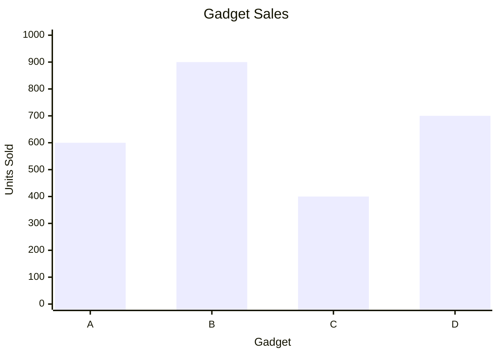

Parent Concept: [[17 - Data Interpretation (DI)/02 - Bar Graphs Interpretation.md]]

Tags: #quant #data_interpretation_di #bar_graphs_interpretation #example #di_basics #graph_reading #mermaid

---

# Reading Bar Graph Example

**Problem:**

The bar graph below shows the number of units sold for four different electronic gadgets (A, B, C, D) by a store in a particular month.

According to the graph, how many units of Gadget B were sold?

(A) 800
(B) 600
(C) 700
(D) 900

## Solution:

This problem requires accurately reading the value represented by a specific bar on the bar graph, using the principles outlined in [[17 - Data Interpretation (DI)/02 - Bar Graphs Interpretation.md|Bar Graphs Interpretation]].

**Step 1:** Identify the bar corresponding to the required category. The question asks for "Gadget B". Locate the bar labelled "B" on the X-axis.

**Step 2:** Trace the top of the identified bar horizontally to the Y-axis (Units Sold).

**Step 3:** Read the value on the Y-axis scale where the top of the bar aligns. The bar for Gadget B reaches exactly halfway between the 800 and 1000 marks.

**Step 4:** Determine the value halfway between 800 and 1000. The midpoint is (800 + 1000) / 2 = 1800 / 2 = 900. Alternatively, since the major gridlines are 200 units apart, halfway is 100 units above 800, which is 800 + 100 = 900.

Therefore, 900 units of Gadget B were sold.

This matches option (D).

## Shortcut/Tip

*   **Target the Label:** Immediately find the label "B" on the X-axis to focus only on the relevant bar. Ignore the others unless needed for comparison later.
*   **Scale Reading Precision:** Pay close attention to the Y-axis scale increments. Here, major lines are 200 apart. If a bar falls *between* lines (like B and D), carefully determine the midpoint or relevant fraction of the interval. Misinterpreting the scale (e.g., thinking the midpoint is 850 or reading the nearest gridline) is a common error.
*   **Visualize Alignment:** Use the edge of a paper or your finger (if allowed) to create a straight horizontal line from the top of the target bar to the Y-axis scale. This aids accurate reading.
*   **Distractor Analysis:**
    *   Option (A) 800: This is the value of the gridline *below* the top of bar B. Selecting this indicates misreading the scale or stopping short.
    *   Option (B) 600: This is the value for Gadget A, resulting from reading the wrong bar.
    *   Option (C) 700: This is the value for Gadget D, again resulting from reading the wrong bar.
    Recognizing that distractors often correspond to adjacent bars or nearby scale markings helps confirm the correct reading.
*   **Units Check:** Although simple here ('units'), always glance if the Y-axis mentions thousands, millions, etc., as this would affect the final answer value.