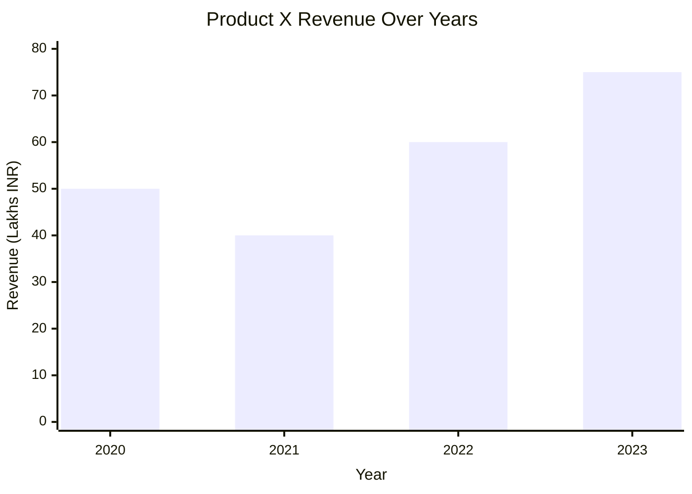

## 17 - Data Interpretation (DI)/02.E02 - Percentage Change from Bar Graph Example

Concept: [[17 - Data Interpretation (DI)/02 - Bar Graphs Interpretation.md]]

Tags: #quant #data_interpretation_di #bar_graphs_interpretation #example #percentage_change #di_calculations #mermaid

---

# Percentage Change from Bar Graph Example

**Problem:**

The bar graph below shows the revenue (in Lakhs INR) of a company from Product X over four consecutive years.

What was the approximate percentage increase in revenue from Product X from 2022 to 2023?

(A) 20%
(B) 75%
(C) 25%
(D) 15%

## Solution:

This problem requires reading values from two specific bars on the graph and then calculating the percentage change between them, following the methods in [[17 - Data Interpretation (DI)/02 - Bar Graphs Interpretation.md|Bar Graphs Interpretation]] and the formula for [[02 - Percentages/02 - Percentage Increase and Decrease.md|Percentage Increase and Decrease]].

**Step 1:** Identify the bars corresponding to the years 2022 and 2023 on the X-axis.

**Step 2:** Read the revenue value for 2022 from the graph. The bar for 2022 reaches the 60 mark on the Y-axis.
   Revenue in 2022 (Old Value) = 60 Lakhs INR.

**Step 3:** Read the revenue value for 2023 from the graph. The bar for 2023 reaches halfway between 70 and 80 on the Y-axis.
   Revenue in 2023 (New Value) = 75 Lakhs INR.

**Step 4:** Calculate the absolute increase in revenue.
   Increase = New Value - Old Value = 75 - 60 = 15 Lakhs INR.

**Step 5:** Calculate the percentage increase using the formula: `% Increase = ((New Value - Old Value) / Old Value) * 100%`
   % Increase = (Increase / Old Value) * 100%
   % Increase = (15 / 60) * 100%

**Step 6:** Simplify the calculation.
   % Increase = (1 / 4) * 100%
   % Increase = 0.25 * 100%
   % Increase = 25%

This matches option (C).

## Shortcut/Tip

*   **Formula Clarity:** Be absolutely sure of the percentage change formula: `Change / Original * 100%`. The most common error is dividing by the *new* value instead of the *original* value.
*   **Identify Base Year:** The phrase "increase... *from* 2022 *to* 2023" clearly indicates that 2022 is the base (original) year, so its value (60) must be the denominator.
*   **Fraction Simplification:** Simplify the fraction `15 / 60` to `1 / 4` before multiplying by 100. Recognizing `1/4` as 0.25 or 25% is much faster.
*   **Pitfall - Wrong Base:** Calculating `(15 / 75) * 100%` gives `(1 / 5) * 100% = 20%`. This corresponds to distractor (A) and results from incorrectly using the 2023 value as the base.
*   **Pitfall - Absolute Change:** Simply noting the absolute change is 15 (Lakhs INR) might lead to confusion or selecting distractor (D) 15%, forgetting the division and multiplication by 100.
*   **Pitfall - Confusing Values:** Using 75 as the change or 60 as the change (misreading the question or graph) could lead to distractor (B) 75% if other errors are made (e.g., 75/?) or simply misinterpreting the 75 value.
*   **Estimation Check:** Revenue increased from 60 to 75. The increase is 15. Is 15 a large or small part of the original 60? 15 is exactly one-quarter (1/4) of 60. One-quarter is 25%. This quick check confirms the calculation.