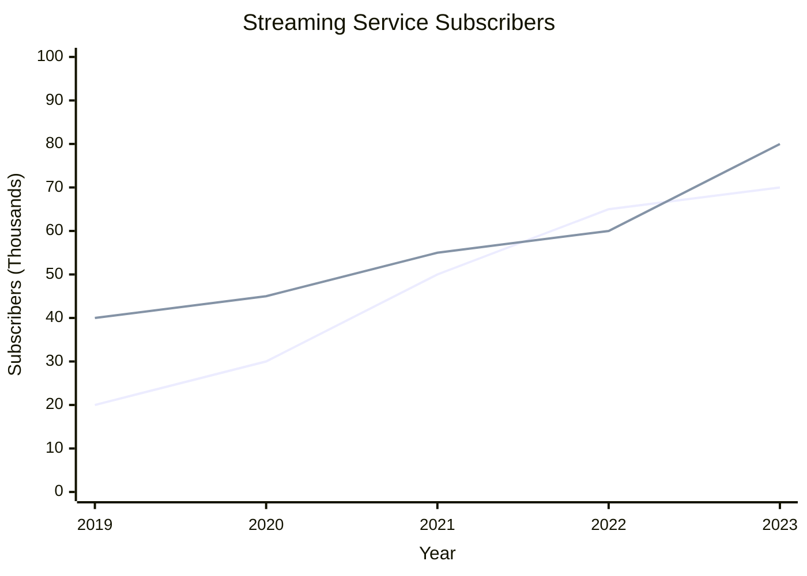

## 17 - Data Interpretation (DI)/03.E01 - Trend Analysis from Line Graph Example

Parent Concept: [[17 - Data Interpretation (DI)/03 - Line Graphs Interpretation.md]]

Tags: #quant #data_interpretation_di #line_graphs_interpretation #example #di_calculations #trend_analysis #rate_of_change #mermaid

---

# Trend Analysis from Line Graph Example

**Problem:**

The line graph below shows the number of subscribers (in thousands) for two different streaming services, Service X and Service Y, from the end of 2019 to the end of 2023.

In which year (compared to the previous year) did Service Y show the largest absolute increase in subscribers?

(A) 2020
(B) 2021
(C) 2022
(D) 2023

## Solution:

This problem requires analyzing the trend of Service Y's subscriber numbers from the line graph to find the year with the maximum absolute increase compared to the preceding year, as per the methods in [[17 - Data Interpretation (DI)/03 - Line Graphs Interpretation.md|Line Graphs Interpretation]]. "Increase in year YYYY" refers to the change from the end of YYYY-1 to the end of YYYY.

**Step 1:** Focus on the line representing Service Y (Solid Line).

**Step 2:** Read the subscriber values for Service Y at the end of each year from the Y-axis.
   - End of 2019: 40 thousand
   - End of 2020: 45 thousand
   - End of 2021: 55 thousand
   - End of 2022: 60 thousand
   - End of 2023: 80 thousand

**Step 3:** Calculate the absolute increase in subscribers for each year compared to the previous year.
   - Increase in 2020 = Value(2020) - Value(2019) = 45 - 40 = 5 thousand
   - Increase in 2021 = Value(2021) - Value(2020) = 55 - 45 = 10 thousand
   - Increase in 2022 = Value(2022) - Value(2021) = 60 - 55 = 5 thousand
   - Increase in 2023 = Value(2023) - Value(2022) = 80 - 60 = 20 thousand

**Step 4:** Compare the calculated increases to find the largest one.
   The increases are 5k, 10k, 5k, and 20k. The largest absolute increase is 20 thousand.

**Step 5:** Identify the year corresponding to the largest increase. The largest increase (20 thousand) occurred in the year 2023 (comparing end of 2023 to end of 2022).

This matches option (D).

## Shortcut/Tip

*   **Visual Estimation (Steepness):** Look for the steepest upward segment on the line for Service Y. The segment between 2022 and 2023 appears visually steeper than the others, suggesting the largest increase occurred then. This helps focus calculations. Calculate the difference for this segment first (80 - 60 = 20). Then quickly check the next steepest (2020-2021: 55 - 45 = 10). Since 20 is greater than 10 and visibly larger than the changes in other segments, you can be confident without calculating all differences.
*   **Absolute vs. Percentage:** The question asks for the *largest absolute increase* (difference in numbers), not the largest *percentage* increase. Be careful not to calculate percentage change unless asked. For instance, the percentage increase for 2021 is (10/45)*100% ≈ 22.2%, while for 2023 it's (20/60)*100% = 33.3%. In this case, 2023 wins on both metrics, but this isn't always true.
*   **Focus on Correct Line:** Ensure you are looking at the correct line (Service Y - Solid Line) based on the legend. Accidentally analyzing Service X would yield incorrect results.
*   **Units Awareness:** Remember the Y-axis is "in Thousands". While it doesn't affect finding the *year* of maximum increase, if a follow-up question asked for the actual value of the increase, the answer would be 20,000, not 20.
*   **Distractor Analysis:** Options (A), (B), and (C) represent years where there *was* an increase, but not the *largest* one. Option (B) (2021, increase of 10k) is the second largest and a plausible distractor if visual estimation isn't precise or a calculation error occurs.