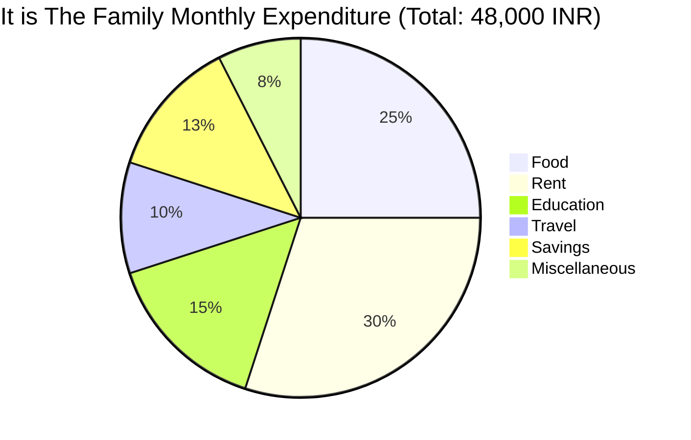

Parent Concept: [[17 - Data Interpretation (DI)/04 - Pie Charts Interpretation.md]]

Tags: #quant #data_interpretation_di #pie_charts_interpretation #example #di_calculations #percentages #angles #mermaid

---

# Calculating Values from Pie Chart Angles Percentages Example

**Problem:**

A pie chart shows the percentage distribution of a family's total monthly expenditure, which amounts to 48,000 INR.

What is the amount spent on Food monthly?

(A) 14,400 INR
(B) 7,200 INR
(C) 12,000 INR
(D) 4,800 INR

## Solution:

This problem requires calculating the absolute value represented by a sector of a pie chart, given the sector's percentage and the total value represented by the chart. This uses the methods described in [[17 - Data Interpretation (DI)/04 - Pie Charts Interpretation.md|Pie Charts Interpretation]].

**Step 1:** Identify the total monthly expenditure represented by the whole pie chart.
   Total Expenditure (T) = 48,000 INR.

**Step 2:** Identify the percentage allocated to the required category (Food) from the pie chart.
   Percentage for Food (P) = 25%.

**Step 3:** Apply the formula to calculate the value of the sector from its percentage:
   `Value = (P / 100) * T`
   Amount spent on Food = (25 / 100) * 48000

**Step 4:** Perform the calculation.
   Amount spent on Food = (1 / 4) * 48000
   Amount spent on Food = 48000 / 4
   Amount spent on Food = 12000 INR.

This matches option (C).

## Shortcut/Tip

*   **Recognize Common Percentages:** 25% is equivalent to the fraction 1/4. Calculating `48000 / 4` is often faster mentally or on paper than calculating `(25 * 48000) / 100`. Similarly, know common fractions like 10% = 1/10, 50% = 1/2, etc.
*   **Targeted Information:** Focus only on the "Food" percentage (25%) and the "Total Expenditure" (48,000). Ignore the percentages for other categories unless needed for a different question.
*   **Pitfall - Wrong Percentage:** Accidentally using the percentage for another category is a common error. For example:
    *   Using Rent (30%): `(30/100) * 48000 = 14400`. This matches distractor (A).
    *   Using Education (15%): `(15/100) * 48000 = 7200`. This matches distractor (B).
    *   Using Travel (10%): `(10/100) * 48000 = 4800`. This matches distractor (D).
*   **Angle Confusion (if applicable):** If the chart used degrees, ensure you use the formula `Value = (θ / 360) * T`. Don't mix percentages and degrees in the same calculation (e.g., don't divide degrees by 100 or percentages by 360).
*   **Estimation:** 25% is one-quarter. A quarter of ~50,000 should be around 12,500. Option (C) 12,000 is the closest, providing a quick sanity check.