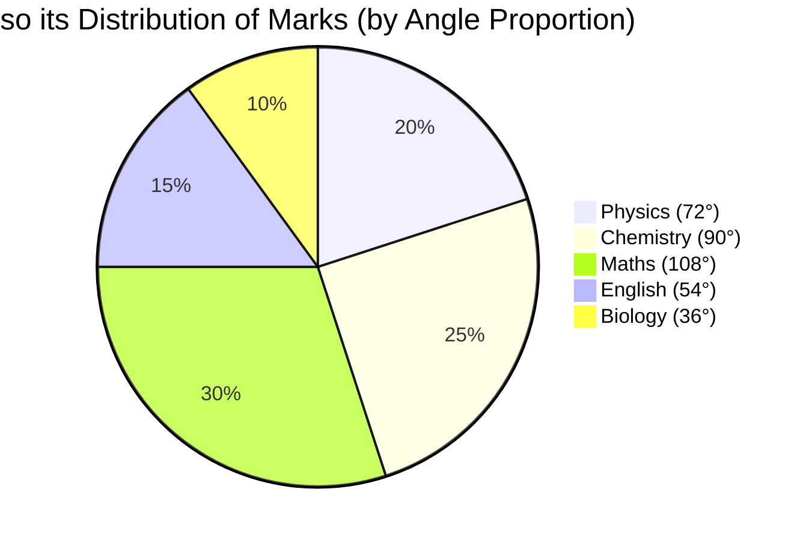

Parent Concept: [[17 - Data Interpretation (DI)/04 - Pie Charts Interpretation.md]]

Tags: #quant #data_interpretation_di #pie_charts_interpretation #example #di_calculations #ratio #percentages #angles #mermaid

---

# Ratio Calculation from Pie Chart Example

**Problem:**

A pie chart represents the distribution of marks obtained by a student in five subjects. The maximum marks for each subject are the same. The central angles for the subjects were Physics (72°), Chemistry (90°), Maths (108°), English (54°), and Biology (36°).

*(Since Mermaid Pie charts take proportional values rather than angles directly, we use values proportional to the angles. The smallest angle is 36°. Let 36° correspond to a value of 1. Then 54°=1.5, 72°=2, 90°=2.5, 108°=3. Total = 10)*

What is the ratio of the marks obtained by the student in Maths to the marks obtained in Biology?

(A) 2 : 1
(B) 1 : 3
(C) 3 : 1
(D) 5 : 2

## Solution:

This problem requires finding the ratio between the values represented by two different sectors of a pie chart, given their central angles. The key principle, as outlined in [[17 - Data Interpretation (DI)/04 - Pie Charts Interpretation.md|Pie Charts Interpretation]], is that the ratio of the values (marks obtained) is equal to the ratio of their corresponding central angles.

**Step 1:** Identify the central angles for the subjects involved in the ratio: Maths and Biology.
   - Central Angle for Maths (θ_Maths) = 108°
   - Central Angle for Biology (θ_Biology) = 36°

**Step 2:** Form the ratio of the marks using the ratio of their central angles.
   Ratio (Maths : Biology) = θ_Maths : θ_Biology
   Ratio (Maths : Biology) = 108 : 36

**Step 3:** Simplify the ratio by dividing both sides by their greatest common divisor.
   - Both 108 and 36 are divisible by 36.
   - (108 / 36) : (36 / 36)
   - 3 : 1
   - This uses the concept of simplifying ratios covered in [[05 - Ratio and Proportion/01 - Ratio Concepts (Duplicate, Triplicate, etc).md|Ratio Concepts]].

The ratio of marks obtained in Maths to Biology is 3:1.

This matches option (C).

## Shortcut/Tip

*   **Direct Ratio of Angles/Percentages:** Crucially, you do *not* need the total marks or the individual marks to find the ratio. The ratio of the parts (marks) is directly equal to the ratio of their corresponding angles (or percentages, if given). Avoid unnecessary calculations.
*   **Ratio Order:** Pay close attention to the order requested: "Maths to Biology" means Maths value comes first in the ratio (108 : 36). Inverting this gives 36 : 108 or 1 : 3, which matches distractor (B). Always verify the order.
*   **Simplification Strategy:** When simplifying 108 : 36, you can divide by common factors progressively if the GCD isn't immediately obvious. E.g., divide by 12 -> 9 : 3. Then divide by 3 -> 3 : 1.
*   **Pitfall - Using Wrong Angles:** Ensure you pick the angles for the correct subjects. Using Physics (72°) or Chemistry (90°) by mistake would lead to incorrect ratios, potentially matching other distractors if designed that way (e.g., Physics:Biology = 72:36 = 2:1, matching option A).
*   **Visual Estimation:** Visually, the Maths sector (108°) is clearly larger than the Biology sector (36°). This immediately rules out ratios where the first number is smaller than the second (like 1:3). 108° is noticeably larger than 90° (a right angle), while 36° is quite small. 108 seems about 3 times 36, making 3:1 plausible.